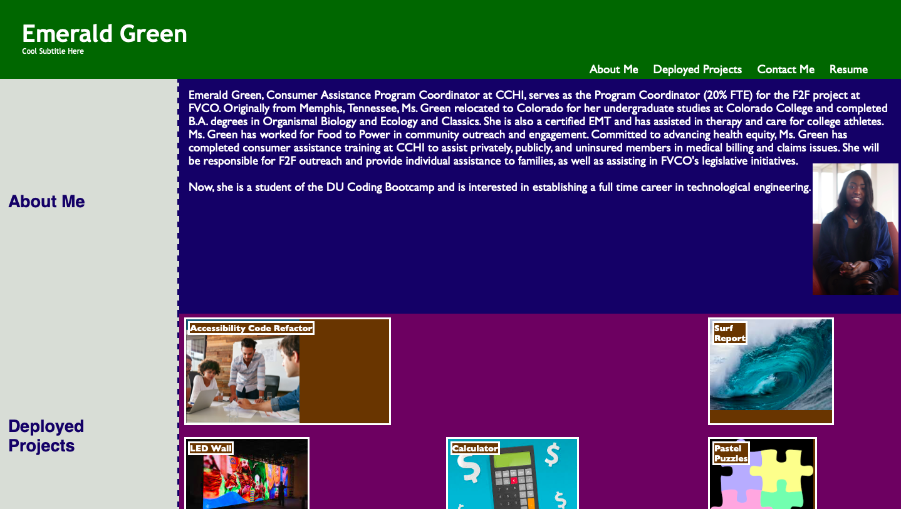
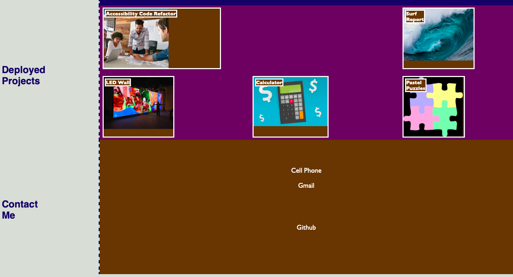

# professional-portfolio
## Description 
This is homework assignment 2 for the DU Coding Bootcamp. It is our first attempt at creating a site for our professional portfolio and includes a section about me, Emerald, my work, and my contact information. 

Of course, most of the items in the "Deployed Projects" section are placeholders. The first project is the homework assignment 1, and all of the items link to the deployed application for that assignment. 

## Screenshot

## Link to Deployed Application 
https://emeraldagreen.github.io/professional-portfolio/ 
